```r
# Bioinformatics Classs 5 
# Plots

x <- rnorm(1000, 0)

summary(x)
```

```
##      Min.   1st Qu.    Median      Mean   3rd Qu.      Max. 
## -3.409083 -0.652925  0.008689 -0.003009  0.654065  2.902776
```

```r
# lets see this data as a graph
boxplot(x)
```

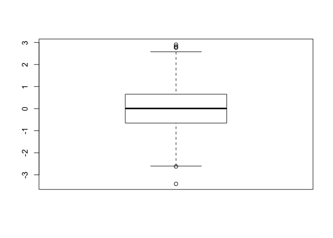<!-- -->

```r
# Good old histogram
hist(x)
```

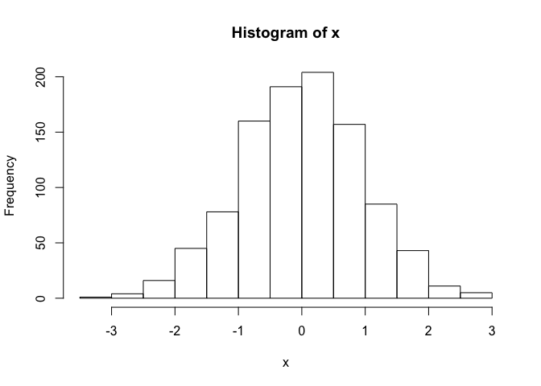<!-- -->

```r
# Section 1 from lab sheet
baby <- read.table("bggn213_05_rstats/weight_chart.txt", header = TRUE)

plot(baby, type="b", pch=15, cex=1, ylim=c(0,12), 
     lwd=3, main="Baby weight")
```

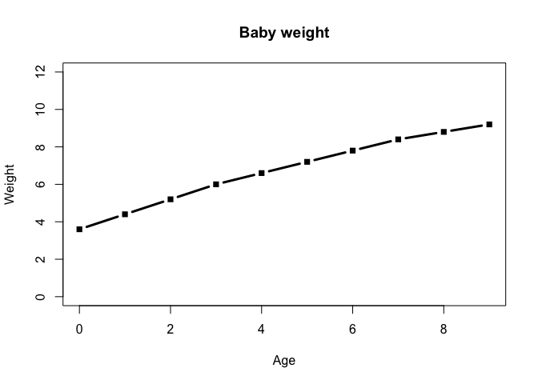<!-- -->

```r
## Section 1B.
feat <- read.table("bggn213_05_rstats/feature_counts.txt", sep="\t",
                   header = TRUE)

par(mar=c(5, 11, 4, 2))  
barplot(feat$Count, names.arg=feat$Feature, horiz = TRUE, las=2)
```

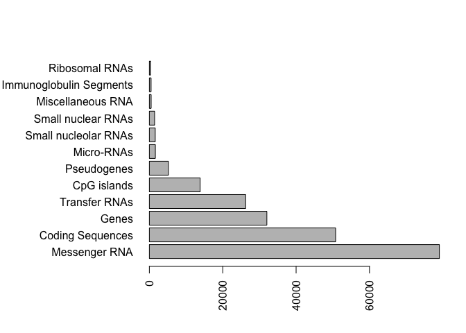<!-- -->

```r
# Section 2A
#read.table("bggn213_05_rstats/male_female_counts.txt", sep="\t", header=TRUE)

mfcount <- read.delim("bggn213_05_rstats/male_female_counts.txt")

barplot(mfcount$Count, col=rainbow(10))
```

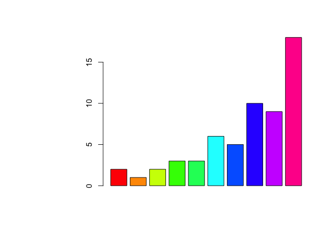<!-- -->

```r
mycols <- cm.colors(nrow(mfcount))
barplot(mfcount$Count, col=mycols)
```

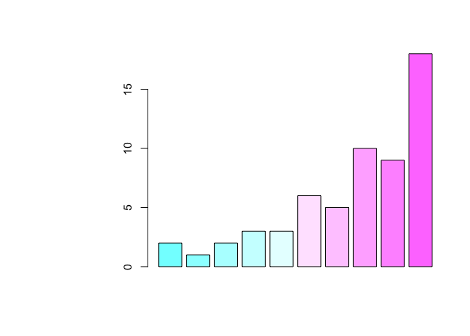<!-- -->

```r
# Section 2B
expr <- read.delim("bggn213_05_rstats/up_down_expression.txt")
plot(expr$Condition1, expr$Condition2, col=expr$State)
```

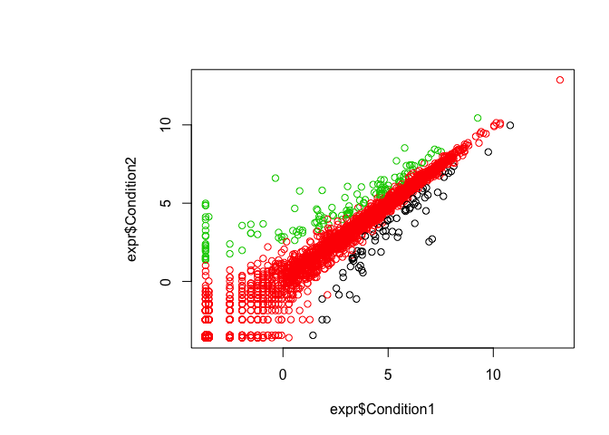<!-- -->

```r
# How may genes went up down and around?
table(expr$State)
```

```
## 
##       down unchanging         up 
##         72       4997        127
```

```r
# Section 2C.
meth <- read.delim("bggn213_05_rstats/expression_methylation.txt")
plot(meth$promoter.meth, meth$gene.meth)
```

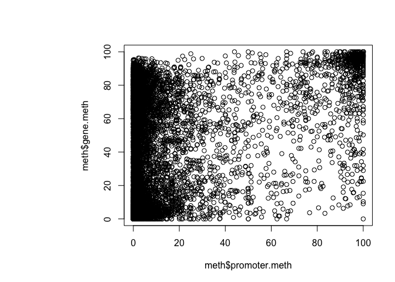<!-- -->

```r
# make a gray to red color vector
expression.palette <- colorRampPalette(c("black","red"))(101) 
expression.low <- min(meth$expression) 
expression.high <- max(meth$expression) 

map.colors <- function (value,high.low,palette) {
  proportion <- ((value-high.low[1])/(high.low[2]-high.low[1]))
  index <- round ((length(palette)-1)*proportion)+1
  return (palette[index])
}

mycol=map.colors(meth$expression,c(expression.high, expression.low),expression.palette)

plot(meth$promoter.meth, meth$gene.meth, col=mycol, pch=15)
```

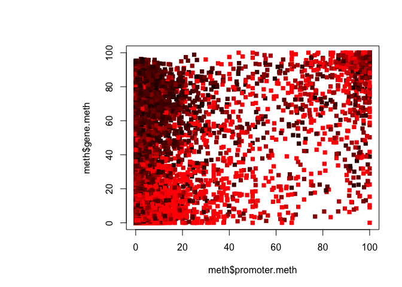<!-- -->

```r
plot(meth$expression, meth$gene.meth, col=mycol, pch=15)
```

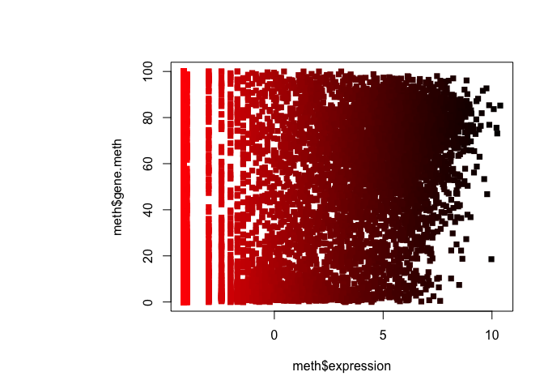<!-- -->

```r
# double check color setting
library("colorspace")
chcols <- diverge_hcl(length(meth$expression))[rank(meth$expression)]
#chcols <- sequential_hcl(length(meth$expression))[rank(meth$expression)]

plot(meth$promoter.meth, meth$gene.meth, col=chcols, pch=15)
```

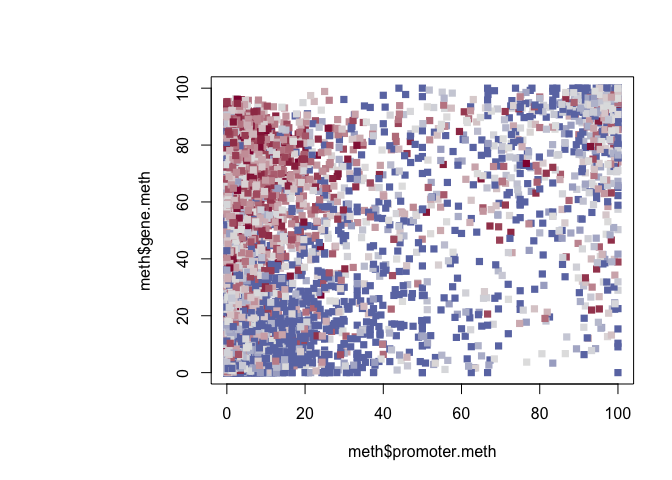<!-- -->


---
title: "class5.R"
author: "barry"
date: "Fri May  4 10:26:53 2018"
---
