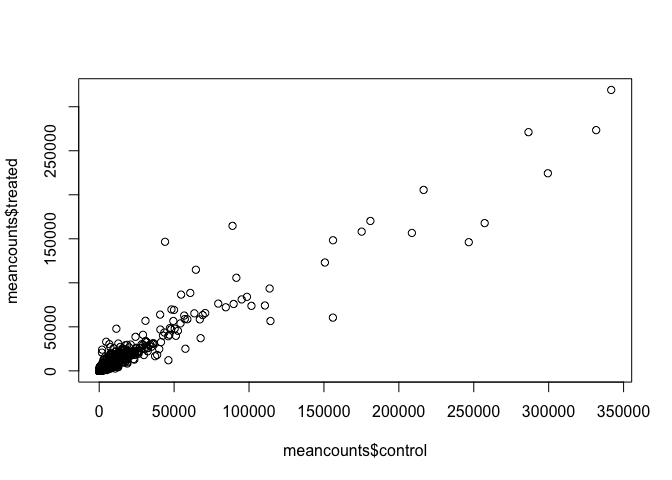
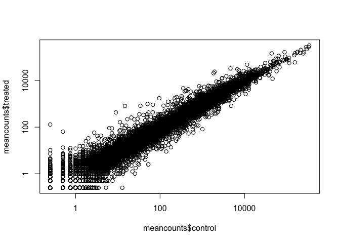
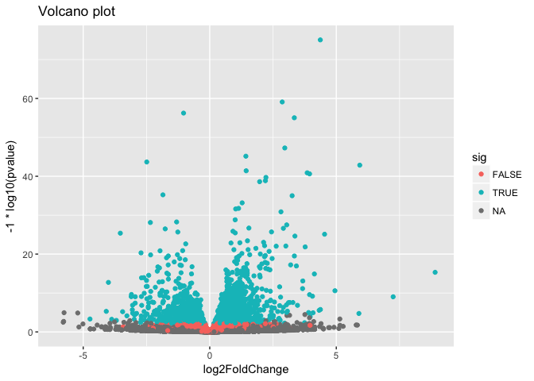

## Transcriptomics and the analysis of RNA-Seq data

Input our count matrix and meta-data matrix about our experiment setup.


```r
counts <- read.csv("data/airway_scaledcounts.csv", stringsAsFactors = FALSE)
metadata <-  read.csv("data/airway_metadata.csv", stringsAsFactors = FALSE)
```


```r
colnames(counts)[-1] == metadata$id
```

```
## [1] TRUE TRUE TRUE TRUE TRUE TRUE TRUE TRUE
```

Calculate the mean counts for each gene accross all control experiments


```r
control <- metadata[metadata[,"dex"]=="control",]
control.mean <- rowSums( counts[ ,control$id] )/nrow(control) 
names(control.mean) <- counts$ensgene
```


```r
head(control.mean)
```

```
## ENSG00000000003 ENSG00000000005 ENSG00000000419 ENSG00000000457 
##          900.75            0.00          520.50          339.75 
## ENSG00000000460 ENSG00000000938 
##           97.25            0.75
```

Now calculate the mean counts for each gene accross all drug treated experiments


```r
treated <- metadata[metadata[,"dex"]=="treated",]
treated.mean <- rowSums( counts[ ,treated$id] )/nrow(treated) 
names(treated.mean) <- counts$ensgene
```

Combine into a new data.frame called `meancounts`.


```r
meancounts <- data.frame(control.mean, treated.mean)
head(meancounts)
```

```
##                 control.mean treated.mean
## ENSG00000000003       900.75       658.00
## ENSG00000000005         0.00         0.00
## ENSG00000000419       520.50       546.00
## ENSG00000000457       339.75       316.50
## ENSG00000000460        97.25        78.75
## ENSG00000000938         0.75         0.00
```


```r
colSums(meancounts)
```

```
## control.mean treated.mean 
##     23005324     22196524
```


Plot our mean counts data for control vs treated


```r
plot(meancounts$control, meancounts$treated)
```

<!-- -->


Plot with log axis so we can see more of our data 

```r
plot(meancounts$control, meancounts$treated, log="xy")
```

```
## Warning in xy.coords(x, y, xlabel, ylabel, log): 15032 x values <= 0
## omitted from logarithmic plot
```

```
## Warning in xy.coords(x, y, xlabel, ylabel, log): 15281 y values <= 0
## omitted from logarithmic plot
```

<!-- -->

Here we calculate log2foldchange, add it to our meancounts data.frame 


```r
meancounts$log2fc <- log2(meancounts[,"treated.mean"]/meancounts[,"control.mean"])
head(meancounts)
```

```
##                 control.mean treated.mean      log2fc
## ENSG00000000003       900.75       658.00 -0.45303916
## ENSG00000000005         0.00         0.00         NaN
## ENSG00000000419       520.50       546.00  0.06900279
## ENSG00000000457       339.75       316.50 -0.10226805
## ENSG00000000460        97.25        78.75 -0.30441833
## ENSG00000000938         0.75         0.00        -Inf
```

Check our understanding of the **which()** function.


```r
x <- matrix(1:10, ncol=2, byrow=TRUE)
x[5,2] <- 0
which(x==0, arr.ind=TRUE)
```

```
##      row col
## [1,]   5   2
```

Find the genes with 0 counts


```r
zero.vals <- which(meancounts[,1:2]==0, arr.ind=TRUE)
head(zero.vals)
```

```
##                 row col
## ENSG00000000005   2   1
## ENSG00000004848  65   1
## ENSG00000004948  70   1
## ENSG00000005001  73   1
## ENSG00000006059 121   1
## ENSG00000006071 123   1
```

Now remove the zero count containing genes


```r
to.rm <- unique(zero.vals[,1])
mycounts <- meancounts[-to.rm,]
head(mycounts)
```

```
##                 control.mean treated.mean      log2fc
## ENSG00000000003       900.75       658.00 -0.45303916
## ENSG00000000419       520.50       546.00  0.06900279
## ENSG00000000457       339.75       316.50 -0.10226805
## ENSG00000000460        97.25        78.75 -0.30441833
## ENSG00000000971      5219.00      6687.50  0.35769358
## ENSG00000001036      2327.00      1785.75 -0.38194109
```

A common threshold used for calling something differentially expressed is a log2(FoldChange) of greater than 2 or less than -2. Let’s filter the dataset both ways to see how many genes are up or down-regulated.


```r
up.ind <- mycounts$log2fc > 2
down.ind <- mycounts$log2fc < (-2)
```


```r
paste("Up:", sum(up.ind))
```

```
## [1] "Up: 250"
```

```r
paste("Down:", sum(down.ind))
```

```
## [1] "Down: 367"
```


## Add annotation

Here we add annotation from a supplied CSV file, such as those available from ENSEMBLE or UCSC.


```r
anno <- read.csv("data/annotables_grch38.csv")
head(anno)
```

```
##           ensgene entrez   symbol chr     start       end strand
## 1 ENSG00000000003   7105   TSPAN6   X 100627109 100639991     -1
## 2 ENSG00000000005  64102     TNMD   X 100584802 100599885      1
## 3 ENSG00000000419   8813     DPM1  20  50934867  50958555     -1
## 4 ENSG00000000457  57147    SCYL3   1 169849631 169894267     -1
## 5 ENSG00000000460  55732 C1orf112   1 169662007 169854080      1
## 6 ENSG00000000938   2268      FGR   1  27612064  27635277     -1
##          biotype
## 1 protein_coding
## 2 protein_coding
## 3 protein_coding
## 4 protein_coding
## 5 protein_coding
## 6 protein_coding
##                                                                                                  description
## 1                                                          tetraspanin 6 [Source:HGNC Symbol;Acc:HGNC:11858]
## 2                                                            tenomodulin [Source:HGNC Symbol;Acc:HGNC:17757]
## 3 dolichyl-phosphate mannosyltransferase polypeptide 1, catalytic subunit [Source:HGNC Symbol;Acc:HGNC:3005]
## 4                                               SCY1-like, kinase-like 3 [Source:HGNC Symbol;Acc:HGNC:19285]
## 5                                    chromosome 1 open reading frame 112 [Source:HGNC Symbol;Acc:HGNC:25565]
## 6                          FGR proto-oncogene, Src family tyrosine kinase [Source:HGNC Symbol;Acc:HGNC:3697]
```

Use the **merge()** function.


```r
results <- merge(mycounts, anno, by.x="row.names", by.y="ensgene")
head(results)
```

```
##         Row.names control.mean treated.mean      log2fc entrez   symbol
## 1 ENSG00000000003       900.75       658.00 -0.45303916   7105   TSPAN6
## 2 ENSG00000000419       520.50       546.00  0.06900279   8813     DPM1
## 3 ENSG00000000457       339.75       316.50 -0.10226805  57147    SCYL3
## 4 ENSG00000000460        97.25        78.75 -0.30441833  55732 C1orf112
## 5 ENSG00000000971      5219.00      6687.50  0.35769358   3075      CFH
## 6 ENSG00000001036      2327.00      1785.75 -0.38194109   2519    FUCA2
##   chr     start       end strand        biotype
## 1   X 100627109 100639991     -1 protein_coding
## 2  20  50934867  50958555     -1 protein_coding
## 3   1 169849631 169894267     -1 protein_coding
## 4   1 169662007 169854080      1 protein_coding
## 5   1 196651878 196747504      1 protein_coding
## 6   6 143494811 143511690     -1 protein_coding
##                                                                                                  description
## 1                                                          tetraspanin 6 [Source:HGNC Symbol;Acc:HGNC:11858]
## 2 dolichyl-phosphate mannosyltransferase polypeptide 1, catalytic subunit [Source:HGNC Symbol;Acc:HGNC:3005]
## 3                                               SCY1-like, kinase-like 3 [Source:HGNC Symbol;Acc:HGNC:19285]
## 4                                    chromosome 1 open reading frame 112 [Source:HGNC Symbol;Acc:HGNC:25565]
## 5                                                     complement factor H [Source:HGNC Symbol;Acc:HGNC:4883]
## 6                                          fucosidase, alpha-L- 2, plasma [Source:HGNC Symbol;Acc:HGNC:4008]
```


### another way to annotate my gene lists


```r
#- One time only install if neccessry
#biocLite("AnnotationDbi")
#biocLite("org.Hs.eg.db")
```


```r
library("AnnotationDbi")
```

```
## Warning: package 'AnnotationDbi' was built under R version 3.4.2
```

```
## Loading required package: stats4
```

```
## Loading required package: BiocGenerics
```

```
## Warning: package 'BiocGenerics' was built under R version 3.4.2
```

```
## Loading required package: parallel
```

```
## 
## Attaching package: 'BiocGenerics'
```

```
## The following objects are masked from 'package:parallel':
## 
##     clusterApply, clusterApplyLB, clusterCall, clusterEvalQ,
##     clusterExport, clusterMap, parApply, parCapply, parLapply,
##     parLapplyLB, parRapply, parSapply, parSapplyLB
```

```
## The following objects are masked from 'package:stats':
## 
##     IQR, mad, sd, var, xtabs
```

```
## The following objects are masked from 'package:base':
## 
##     anyDuplicated, append, as.data.frame, cbind, colMeans,
##     colnames, colSums, do.call, duplicated, eval, evalq, Filter,
##     Find, get, grep, grepl, intersect, is.unsorted, lapply,
##     lengths, Map, mapply, match, mget, order, paste, pmax,
##     pmax.int, pmin, pmin.int, Position, rank, rbind, Reduce,
##     rowMeans, rownames, rowSums, sapply, setdiff, sort, table,
##     tapply, union, unique, unsplit, which, which.max, which.min
```

```
## Loading required package: Biobase
```

```
## Warning: package 'Biobase' was built under R version 3.4.2
```

```
## Welcome to Bioconductor
## 
##     Vignettes contain introductory material; view with
##     'browseVignettes()'. To cite Bioconductor, see
##     'citation("Biobase")', and for packages 'citation("pkgname")'.
```

```
## Loading required package: IRanges
```

```
## Warning: package 'IRanges' was built under R version 3.4.2
```

```
## Loading required package: S4Vectors
```

```
## Warning: package 'S4Vectors' was built under R version 3.4.2
```

```
## 
## Attaching package: 'S4Vectors'
```

```
## The following object is masked from 'package:base':
## 
##     expand.grid
```

```r
library("org.Hs.eg.db")
```

```
## 
```

```r
columns(org.Hs.eg.db)
```

```
##  [1] "ACCNUM"       "ALIAS"        "ENSEMBL"      "ENSEMBLPROT" 
##  [5] "ENSEMBLTRANS" "ENTREZID"     "ENZYME"       "EVIDENCE"    
##  [9] "EVIDENCEALL"  "GENENAME"     "GO"           "GOALL"       
## [13] "IPI"          "MAP"          "OMIM"         "ONTOLOGY"    
## [17] "ONTOLOGYALL"  "PATH"         "PFAM"         "PMID"        
## [21] "PROSITE"      "REFSEQ"       "SYMBOL"       "UCSCKG"      
## [25] "UNIGENE"      "UNIPROT"
```


```r
mycounts$symbol <- mapIds(org.Hs.eg.db,
                     keys=row.names(mycounts),
                     column="SYMBOL",
                     keytype="ENSEMBL",
                     multiVals="first")
```

```
## 'select()' returned 1:many mapping between keys and columns
```

```r
head(mycounts)
```

```
##                 control.mean treated.mean      log2fc   symbol
## ENSG00000000003       900.75       658.00 -0.45303916   TSPAN6
## ENSG00000000419       520.50       546.00  0.06900279     DPM1
## ENSG00000000457       339.75       316.50 -0.10226805    SCYL3
## ENSG00000000460        97.25        78.75 -0.30441833 C1orf112
## ENSG00000000971      5219.00      6687.50  0.35769358      CFH
## ENSG00000001036      2327.00      1785.75 -0.38194109    FUCA2
```


# DESeq2 Analysis

Setup our DESeq Data Set (a 'DESeqDataSet' class object)


```r
library(DESeq2)
```

```
## Warning: package 'DESeq2' was built under R version 3.4.2
```

```
## Loading required package: GenomicRanges
```

```
## Warning: package 'GenomicRanges' was built under R version 3.4.3
```

```
## Loading required package: GenomeInfoDb
```

```
## Warning: package 'GenomeInfoDb' was built under R version 3.4.2
```

```
## Loading required package: SummarizedExperiment
```

```
## Warning: package 'SummarizedExperiment' was built under R version 3.4.3
```

```
## Loading required package: DelayedArray
```

```
## Warning: package 'DelayedArray' was built under R version 3.4.2
```

```
## Loading required package: matrixStats
```

```
## 
## Attaching package: 'matrixStats'
```

```
## The following objects are masked from 'package:Biobase':
## 
##     anyMissing, rowMedians
```

```
## 
## Attaching package: 'DelayedArray'
```

```
## The following objects are masked from 'package:matrixStats':
## 
##     colMaxs, colMins, colRanges, rowMaxs, rowMins, rowRanges
```

```
## The following object is masked from 'package:base':
## 
##     apply
```

```r
dds <- DESeqDataSetFromMatrix(countData=counts, 
                              colData=metadata, 
                              design=~dex, 
                              tidy=TRUE)
```

```
## converting counts to integer mode
```

```
## Warning in DESeqDataSet(se, design = design, ignoreRank): some variables in
## design formula are characters, converting to factors
```

```r
dds
```

```
## class: DESeqDataSet 
## dim: 38694 8 
## metadata(1): version
## assays(1): counts
## rownames(38694): ENSG00000000003 ENSG00000000005 ...
##   ENSG00000283120 ENSG00000283123
## rowData names(0):
## colnames(8): SRR1039508 SRR1039509 ... SRR1039520 SRR1039521
## colData names(4): id dex celltype geo_id
```


```r
#results(dds)
```


```r
dds <- DESeq(dds)
```

```
## estimating size factors
```

```
## estimating dispersions
```

```
## gene-wise dispersion estimates
```

```
## mean-dispersion relationship
```

```
## final dispersion estimates
```

```
## fitting model and testing
```


We can get results out of the object simply by calling the results() function on the DESeqDataSet that has been run through the pipeline. 


```r
res <- results(dds)
res
```

```
## log2 fold change (MLE): dex treated vs control 
## Wald test p-value: dex treated vs control 
## DataFrame with 38694 rows and 6 columns
##                  baseMean log2FoldChange     lfcSE       stat     pvalue
##                 <numeric>      <numeric> <numeric>  <numeric>  <numeric>
## ENSG00000000003 747.19420    -0.35070283 0.1682342 -2.0846111 0.03710462
## ENSG00000000005   0.00000             NA        NA         NA         NA
## ENSG00000000419 520.13416     0.20610652 0.1010134  2.0403876 0.04131173
## ENSG00000000457 322.66484     0.02452714 0.1451103  0.1690242 0.86577762
## ENSG00000000460  87.68263    -0.14714409 0.2569657 -0.5726216 0.56690095
## ...                   ...            ...       ...        ...        ...
## ENSG00000283115  0.000000             NA        NA         NA         NA
## ENSG00000283116  0.000000             NA        NA         NA         NA
## ENSG00000283119  0.000000             NA        NA         NA         NA
## ENSG00000283120  0.974916     -0.6682308  1.694063 -0.3944544  0.6932456
## ENSG00000283123  0.000000             NA        NA         NA         NA
##                      padj
##                 <numeric>
## ENSG00000000003 0.1630257
## ENSG00000000005        NA
## ENSG00000000419 0.1757326
## ENSG00000000457 0.9616577
## ENSG00000000460 0.8157061
## ...                   ...
## ENSG00000283115        NA
## ENSG00000283116        NA
## ENSG00000283119        NA
## ENSG00000283120        NA
## ENSG00000283123        NA
```

We can summarize some basic tallies using the summary function

```r
summary(res)
```

```
## 
## out of 25258 with nonzero total read count
## adjusted p-value < 0.1
## LFC > 0 (up)     : 1564, 6.2% 
## LFC < 0 (down)   : 1188, 4.7% 
## outliers [1]     : 142, 0.56% 
## low counts [2]   : 9971, 39% 
## (mean count < 10)
## [1] see 'cooksCutoff' argument of ?results
## [2] see 'independentFiltering' argument of ?results
```

Order our results by p-value


```r
resOrdered <- res[order(res$pvalue),]
head(resOrdered)
```

```
## log2 fold change (MLE): dex treated vs control 
## Wald test p-value: dex treated vs control 
## DataFrame with 6 rows and 6 columns
##                   baseMean log2FoldChange      lfcSE      stat
##                  <numeric>      <numeric>  <numeric> <numeric>
## ENSG00000152583   954.7709       4.368359 0.23713648  18.42129
## ENSG00000179094   743.2527       2.863888 0.17555825  16.31304
## ENSG00000116584  2277.9135      -1.034700 0.06505273 -15.90556
## ENSG00000189221  2383.7537       3.341544 0.21241508  15.73120
## ENSG00000120129  3440.7038       2.965211 0.20370277  14.55656
## ENSG00000148175 13493.9204       1.427168 0.10036663  14.21955
##                       pvalue         padj
##                    <numeric>    <numeric>
## ENSG00000152583 8.867079e-76 1.342919e-71
## ENSG00000179094 7.972621e-60 6.037267e-56
## ENSG00000116584 5.798513e-57 2.927283e-53
## ENSG00000189221 9.244206e-56 3.500088e-52
## ENSG00000120129 5.306416e-48 1.607313e-44
## ENSG00000148175 6.929711e-46 1.749175e-42
```

> **Q9.** How many are significant with an adjusted p-value < 0.05? How about 0.01? Save this last set of results as resSig01.


```r
resSig05 <- subset(as.data.frame(res), padj < 0.05)
nrow(resSig05)
```

```
## [1] 2182
```


```r
resSig01 <- subset(as.data.frame(res), padj < 0.01)
nrow(resSig01)
```

```
## [1] 1437
```

> **Q10.**  Using either the previously generated anno object (annotations from the file annotables_grch38.csv file) or the mapIds() function (from the AnnotationDbi package) add annotation to your res01 results data.frame.


```r
resSig01$symbol <- mapIds(org.Hs.eg.db,
                     keys=row.names(resSig01),
                     column="SYMBOL",
                     keytype="ENSEMBL",
                     multiVals="first")
```

```
## 'select()' returned 1:many mapping between keys and columns
```

```r
resSig01$uniprot <- mapIds(org.Hs.eg.db,
                     keys=row.names(resSig01),
                     column="UNIPROT",
                     keytype="ENSEMBL",
                     multiVals="first")
```

```
## 'select()' returned 1:many mapping between keys and columns
```

```r
head(resSig01)
```

```
##                  baseMean log2FoldChange      lfcSE      stat       pvalue
## ENSG00000002834 8609.1828      0.4168750 0.10827683  3.850085 1.180767e-04
## ENSG00000003096  414.0753     -0.9645789 0.19172945 -5.030937 4.880878e-07
## ENSG00000003402 3368.7234      1.1624996 0.12612244  9.217230 3.048738e-20
## ENSG00000004059 1684.3218      0.3796901 0.11417088  3.325630 8.821899e-04
## ENSG00000004487 1255.8003     -0.3341069 0.09600563 -3.480076 5.012723e-04
## ENSG00000004700 1510.2085      0.4095532 0.11914030  3.437570 5.869579e-04
##                         padj symbol    uniprot
## ENSG00000002834 1.824767e-03  LASP1     B4DIC4
## ENSG00000003096 1.490341e-05 KLHL13 A0A0C4DG99
## ENSG00000003402 7.859356e-18  CFLAR A0A024R3Z7
## ENSG00000004059 9.389154e-03   ARF5     A4D0Z3
## ENSG00000004487 6.006146e-03  KDM1A     O60341
## ENSG00000004700 6.760059e-03  RECQL A0A024RAV2
```

Order by addjusted pvalue or log2fold change and write out to a CSV file.


```r
ord <- order( resSig01$padj )
head(resSig01[ord,])
```

```
##                   baseMean log2FoldChange      lfcSE      stat
## ENSG00000152583   954.7709       4.368359 0.23713648  18.42129
## ENSG00000179094   743.2527       2.863888 0.17555825  16.31304
## ENSG00000116584  2277.9135      -1.034700 0.06505273 -15.90556
## ENSG00000189221  2383.7537       3.341544 0.21241508  15.73120
## ENSG00000120129  3440.7038       2.965211 0.20370277  14.55656
## ENSG00000148175 13493.9204       1.427168 0.10036663  14.21955
##                       pvalue         padj  symbol    uniprot
## ENSG00000152583 8.867079e-76 1.342919e-71 SPARCL1 A0A024RDE1
## ENSG00000179094 7.972621e-60 6.037267e-56    PER1     O15534
## ENSG00000116584 5.798513e-57 2.927283e-53 ARHGEF2     Q92974
## ENSG00000189221 9.244206e-56 3.500088e-52    MAOA     P21397
## ENSG00000120129 5.306416e-48 1.607313e-44   DUSP1     B4DU40
## ENSG00000148175 6.929711e-46 1.749175e-42    STOM     F8VSL7
```


```r
write.csv( resSig01[ord,], file="signif01_results.csv" )
```

# Data Visualization

First, let’s add a column called sig to our full res results that evaluates to TRUE if padj<0.05, and FALSE if not, and NA if padj is also NA.


```r
res$sig <- res$padj<0.05

# How many of each?
table(res$sig)
```

```
## 
## FALSE  TRUE 
## 12963  2182
```


```r
library(ggplot2)

ggplot(as.data.frame(res), aes(log2FoldChange, -1*log10(pvalue), col=sig)) + 
    geom_point() + 
    ggtitle("Volcano plot")
```

```
## Warning: Removed 13578 rows containing missing values (geom_point).
```

<!-- -->


```r
sessionInfo()
```

```
## R version 3.4.1 (2017-06-30)
## Platform: x86_64-apple-darwin15.6.0 (64-bit)
## Running under: macOS High Sierra 10.13.4
## 
## Matrix products: default
## BLAS: /Library/Frameworks/R.framework/Versions/3.4/Resources/lib/libRblas.0.dylib
## LAPACK: /Library/Frameworks/R.framework/Versions/3.4/Resources/lib/libRlapack.dylib
## 
## locale:
## [1] en_US.UTF-8/en_US.UTF-8/en_US.UTF-8/C/en_US.UTF-8/en_US.UTF-8
## 
## attached base packages:
## [1] parallel  stats4    stats     graphics  grDevices utils     datasets 
## [8] methods   base     
## 
## other attached packages:
##  [1] ggplot2_2.2.1              DESeq2_1.18.1             
##  [3] SummarizedExperiment_1.8.1 DelayedArray_0.4.1        
##  [5] matrixStats_0.52.2         GenomicRanges_1.30.1      
##  [7] GenomeInfoDb_1.14.0        org.Hs.eg.db_3.5.0        
##  [9] AnnotationDbi_1.40.0       IRanges_2.12.0            
## [11] S4Vectors_0.16.0           Biobase_2.38.0            
## [13] BiocGenerics_0.24.0       
## 
## loaded via a namespace (and not attached):
##  [1] locfit_1.5-9.1         Rcpp_0.12.16           lattice_0.20-35       
##  [4] rprojroot_1.3-2        digest_0.6.14          plyr_1.8.4            
##  [7] backports_1.1.2        acepack_1.4.1          RSQLite_2.0           
## [10] evaluate_0.10.1        zlibbioc_1.24.0        rlang_0.1.6           
## [13] lazyeval_0.2.1         rstudioapi_0.7         data.table_1.10.4-3   
## [16] annotate_1.56.1        blob_1.1.0             rpart_4.1-12          
## [19] Matrix_1.2-12          checkmate_1.8.5        rmarkdown_1.9         
## [22] labeling_0.3           splines_3.4.1          BiocParallel_1.12.0   
## [25] geneplotter_1.56.0     stringr_1.3.0          foreign_0.8-69        
## [28] htmlwidgets_1.2.1      RCurl_1.95-4.10        bit_1.1-12            
## [31] munsell_0.4.3          compiler_3.4.1         pkgconfig_2.0.1       
## [34] base64enc_0.1-3        htmltools_0.3.6        nnet_7.3-12           
## [37] tibble_1.3.4           gridExtra_2.3          htmlTable_1.11.2      
## [40] GenomeInfoDbData_1.0.0 Hmisc_4.1-1            XML_3.98-1.9          
## [43] bitops_1.0-6           grid_3.4.1             xtable_1.8-2          
## [46] gtable_0.2.0           DBI_0.7                magrittr_1.5          
## [49] scales_0.5.0           stringi_1.1.7          XVector_0.18.0        
## [52] genefilter_1.60.0      latticeExtra_0.6-28    Formula_1.2-2         
## [55] RColorBrewer_1.1-2     tools_3.4.1            bit64_0.9-7           
## [58] survival_2.41-3        yaml_2.1.18            colorspace_1.3-2      
## [61] cluster_2.0.6          memoise_1.1.0          knitr_1.20
```


